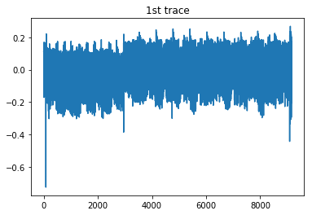
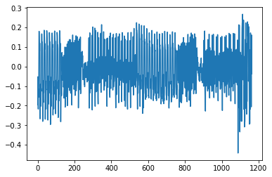
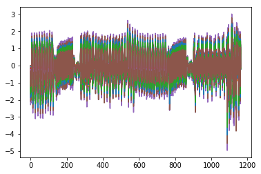
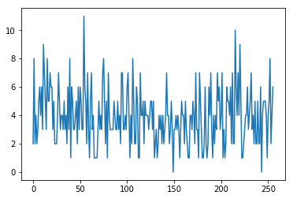
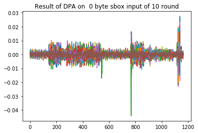
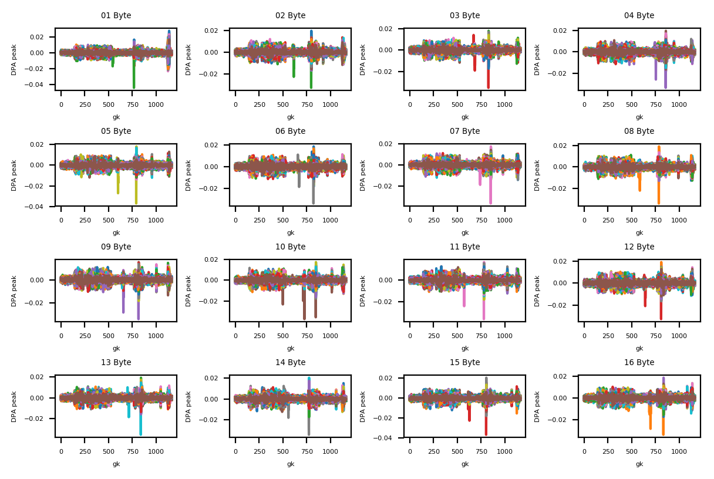

# Tutorial on Differential Power Analysis


```python
# -*- coding: utf-8 -*-

"""

----------------------------------------------------

Author : Sunghyun Jin (sunghyunjin@korea.ac.kr)

Cryptographic Algorithm Lab.
School of Cyber Security,
Center for Information Security Technologies (CIST),
Institute of Cyber Security & Privacy (ICSP),
Korea University,
Republic of Korea

----------------------------------------------------

"""

from __future__ import absolute_import
from __future__ import division
from __future__ import print_function

import struct
#import time

import numpy as np
import matplotlib.pyplot as plt
import tqdm
```

## Load data


```python
# load plaintext
f = open('plaintext1.txt')
tmp = f.readlines()
f.close()

pt = np.array([int(tmp[0][i:i+2], 16) for i in range(0,len(tmp[0])-1,2)], dtype = np.uint8)
print('1st plaintext  :', ''.join([i[2:].upper() for i in map(hex, pt)]))

# load ciphertext
f = open('ciphertext.txt')
tmp = f.readlines()
f.close()

ct = np.zeros((len(tmp), 16), dtype = np.uint8)
for i in range(len(tmp)):
    ct[i,:] = [int(tmp[i][j:j+2], 16) for j in range(0,len(tmp[i])-1,2)]
print('1st ciphertext :', ''.join([i[2:].upper() for i in map(hex, ct[0])]))
```

    1st plaintext  : 4FEC6E2FE7FA701C426898439AB6381E
    1st ciphertext : C02A70A410503181FEEB5EF74522E468
    


```python
# load trace
f = open('traces.bin', 'rb')
meta = f.read(8)
tnum = struct.unpack('<I', meta[0:4])[0]
tlen = struct.unpack('<I', meta[4:])[0]

ts = np.zeros([tnum, tlen], dtype = np.float32)
for i in tqdm.tqdm(range(tnum)):
    tmp = f.read(tlen * 4)
    ts[i,:] = np.array([struct.unpack('@f', tmp[j:j+4])[0] for j in range(0, tlen*4, 4)])

f.close()

print('number of traces :', tnum)
print('length of trace :', tlen)

plt.title('1st trace')
plt.plot(ts[0])
plt.show()
```

    100%|█████████████████████████████████████████| 1000/1000 [00:02<00:00, 362.06it/s]
    

    number of traces : 1000
    length of trace : 9163
    





```python
hw = np.array([bin(n).count("1") for n in range(0, 2**8)])
AES_Sbox = np.array([
    0x63, 0x7C, 0x77, 0x7B, 0xF2, 0x6B, 0x6F, 0xC5, 0x30, 0x01, 0x67, 0x2B, 0xFE, 0xD7, 0xAB, 0x76,
    0xCA, 0x82, 0xC9, 0x7D, 0xFA, 0x59, 0x47, 0xF0, 0xAD, 0xD4, 0xA2, 0xAF, 0x9C, 0xA4, 0x72, 0xC0,
    0xB7, 0xFD, 0x93, 0x26, 0x36, 0x3F, 0xF7, 0xCC, 0x34, 0xA5, 0xE5, 0xF1, 0x71, 0xD8, 0x31, 0x15,
    0x04, 0xC7, 0x23, 0xC3, 0x18, 0x96, 0x05, 0x9A, 0x07, 0x12, 0x80, 0xE2, 0xEB, 0x27, 0xB2, 0x75,
    0x09, 0x83, 0x2C, 0x1A, 0x1B, 0x6E, 0x5A, 0xA0, 0x52, 0x3B, 0xD6, 0xB3, 0x29, 0xE3, 0x2F, 0x84,
    0x53, 0xD1, 0x00, 0xED, 0x20, 0xFC, 0xB1, 0x5B, 0x6A, 0xCB, 0xBE, 0x39, 0x4A, 0x4C, 0x58, 0xCF,
    0xD0, 0xEF, 0xAA, 0xFB, 0x43, 0x4D, 0x33, 0x85, 0x45, 0xF9, 0x02, 0x7F, 0x50, 0x3C, 0x9F, 0xA8,
    0x51, 0xA3, 0x40, 0x8F, 0x92, 0x9D, 0x38, 0xF5, 0xBC, 0xB6, 0xDA, 0x21, 0x10, 0xFF, 0xF3, 0xD2,
    0xCD, 0x0C, 0x13, 0xEC, 0x5F, 0x97, 0x44, 0x17, 0xC4, 0xA7, 0x7E, 0x3D, 0x64, 0x5D, 0x19, 0x73,
    0x60, 0x81, 0x4F, 0xDC, 0x22, 0x2A, 0x90, 0x88, 0x46, 0xEE, 0xB8, 0x14, 0xDE, 0x5E, 0x0B, 0xDB,
    0xE0, 0x32, 0x3A, 0x0A, 0x49, 0x06, 0x24, 0x5C, 0xC2, 0xD3, 0xAC, 0x62, 0x91, 0x95, 0xE4, 0x79,
    0xE7, 0xC8, 0x37, 0x6D, 0x8D, 0xD5, 0x4E, 0xA9, 0x6C, 0x56, 0xF4, 0xEA, 0x65, 0x7A, 0xAE, 0x08,
    0xBA, 0x78, 0x25, 0x2E, 0x1C, 0xA6, 0xB4, 0xC6, 0xE8, 0xDD, 0x74, 0x1F, 0x4B, 0xBD, 0x8B, 0x8A,
    0x70, 0x3E, 0xB5, 0x66, 0x48, 0x03, 0xF6, 0x0E, 0x61, 0x35, 0x57, 0xB9, 0x86, 0xC1, 0x1D, 0x9E,
    0xE1, 0xF8, 0x98, 0x11, 0x69, 0xD9, 0x8E, 0x94, 0x9B, 0x1E, 0x87, 0xE9, 0xCE, 0x55, 0x28, 0xDF,
    0x8C, 0xA1, 0x89, 0x0D, 0xBF, 0xE6, 0x42, 0x68, 0x41, 0x99, 0x2D, 0x0F, 0xB0, 0x54, 0xBB, 0x16
            ])
AES_iSbox = np.array([
    0x52, 0x09, 0x6A, 0xD5, 0x30, 0x36, 0xA5, 0x38, 0xBF, 0x40, 0xA3, 0x9E, 0x81, 0xF3, 0xD7, 0xFB,
    0x7C, 0xE3, 0x39, 0x82, 0x9B, 0x2F, 0xFF, 0x87, 0x34, 0x8E, 0x43, 0x44, 0xC4, 0xDE, 0xE9, 0xCB,
    0x54, 0x7B, 0x94, 0x32, 0xA6, 0xC2, 0x23, 0x3D, 0xEE, 0x4C, 0x95, 0x0B, 0x42, 0xFA, 0xC3, 0x4E,
    0x08, 0x2E, 0xA1, 0x66, 0x28, 0xD9, 0x24, 0xB2, 0x76, 0x5B, 0xA2, 0x49, 0x6D, 0x8B, 0xD1, 0x25,
    0x72, 0xF8, 0xF6, 0x64, 0x86, 0x68, 0x98, 0x16, 0xD4, 0xA4, 0x5C, 0xCC, 0x5D, 0x65, 0xB6, 0x92,
    0x6C, 0x70, 0x48, 0x50, 0xFD, 0xED, 0xB9, 0xDA, 0x5E, 0x15, 0x46, 0x57, 0xA7, 0x8D, 0x9D, 0x84,
    0x90, 0xD8, 0xAB, 0x00, 0x8C, 0xBC, 0xD3, 0x0A, 0xF7, 0xE4, 0x58, 0x05, 0xB8, 0xB3, 0x45, 0x06,
    0xD0, 0x2C, 0x1E, 0x8F, 0xCA, 0x3F, 0x0F, 0x02, 0xC1, 0xAF, 0xBD, 0x03, 0x01, 0x13, 0x8A, 0x6B,
    0x3A, 0x91, 0x11, 0x41, 0x4F, 0x67, 0xDC, 0xEA, 0x97, 0xF2, 0xCF, 0xCE, 0xF0, 0xB4, 0xE6, 0x73,
    0x96, 0xAC, 0x74, 0x22, 0xE7, 0xAD, 0x35, 0x85, 0xE2, 0xF9, 0x37, 0xE8, 0x1C, 0x75, 0xDF, 0x6E,
    0x47, 0xF1, 0x1A, 0x71, 0x1D, 0x29, 0xC5, 0x89, 0x6F, 0xB7, 0x62, 0x0E, 0xAA, 0x18, 0xBE, 0x1B,
    0xFC, 0x56, 0x3E, 0x4B, 0xC6, 0xD2, 0x79, 0x20, 0x9A, 0xDB, 0xC0, 0xFE, 0x78, 0xCD, 0x5A, 0xF4,
    0x1F, 0xDD, 0xA8, 0x33, 0x88, 0x07, 0xC7, 0x31, 0xB1, 0x12, 0x10, 0x59, 0x27, 0x80, 0xEC, 0x5F,
    0x60, 0x51, 0x7F, 0xA9, 0x19, 0xB5, 0x4A, 0x0D, 0x2D, 0xE5, 0x7A, 0x9F, 0x93, 0xC9, 0x9C, 0xEF,
    0xA0, 0xE0, 0x3B, 0x4D, 0xAE, 0x2A, 0xF5, 0xB0, 0xC8, 0xEB, 0xBB, 0x3C, 0x83, 0x53, 0x99, 0x61,
    0x17, 0x2B, 0x04, 0x7E, 0xBA, 0x77, 0xD6, 0x26, 0xE1, 0x69, 0x14, 0x63, 0x55, 0x21, 0x0C, 0x7D
])
```


```python
ts = ts[:,8000:]
plt.plot(ts[0])
plt.show()
```





## Differential Power Analysis

We will attack the target input of 10 round sbox with guessing each 10 round key byte.

First, we attack 1st byte.

For efficiency, we calculate sums of traces on cipher text.
(Actually, there is no need to sum of trace per guess key. We use sums of traces that are precalculated)


```python
target_byte = 1 - 1

sts_dist = np.zeros((256,1))
sts = np.zeros((256, ts.shape[1]), dtype = np.float32)
for i in range(256):
    ind = np.where(ct[:, target_byte] == i)[0]
    sts_dist[i] = ind.shape[0]
    if sts_dist[i] > 0:
        sts[i,:] = np.sum(ts[ind,:], axis = 0)

plt.plot(sts.T)
plt.show()

plt.plot(sts_dist)
plt.show()
```








```python
dpat = np.zeros((256, ts.shape[1]))
ms1 = np.zeros((ts.shape[1], 1))
ms2 = np.zeros((ts.shape[1], 1))
for gk in range(256):
    guess2si = hw[AES_iSbox[np.array(range(256)) ^ gk]]
    
    ind1 = np.where(guess2si > 4)[0]
    ind2 = np.where(guess2si < 4)[0]
    
    ms1 = np.sum(sts[ind1,:], axis = 0) / np.sum(sts_dist[ind1])
    ms2 = np.sum(sts[ind2,:], axis = 0) / np.sum(sts_dist[ind2])
    dpat[gk,:] = ms1 - ms2
    
plt.title('Result of DPA on {0:2d} byte sbox input of 10 round'.format(target_byte))
plt.plot(dpat.T)
plt.show()
```





```python
def guess_key_from_dpat(dpat, targetbyte):
    dpat1 = np.abs(dpat)

    # list of (gk, position of peak, absolute peak)
    dpat2 = np.array([[i, j, dpat1[i,j]] for i,j in zip(range(dpat1.shape[0]),
                                                        dpat1.argmax(axis=1))])

    ind_tmp1 = np.argsort(dpat2[:,2])

    gk = int(dpat2[ind_tmp1[-1], 0])
    peak_1_pos = int(dpat2[ind_tmp1[-1], 1])
    peak_1 = dpat2[ind_tmp1[-1], 2]
    peak_2 = dpat2[ind_tmp1[-2], 2]

    print('%02d Byte guess : %02X (%3d) at %d : 1st peak %f : confidence %f' % (targetbyte+1,
                                                                                gk,
                                                                                gk,
                                                                                peak_1_pos,
                                                                                peak_1,
                                                                                peak_1/peak_2))
    #ind_tmp1.reverse()
    dpat3 = dpat2[ind_tmp1]
    return dpat3
```


```python
tmp = guess_key_from_dpat(dpat, target_byte)
```

    01 Byte guess : F2 (242) at 767 : 1st peak 0.044233 : confidence 1.606373
    

Results of DPA on each byte


```python
dpat = np.zeros((16, 256, ts.shape[1]))
ms1 = np.zeros((ts.shape[1], 1))
ms2 = np.zeros((ts.shape[1], 1))
sts_dist = np.zeros((256,1))
sts = np.zeros((256, ts.shape[1]), dtype = np.float32)

gkl = []

for target in range(16):
    sts_dist[:] = 0
    sts[:] = 0
    for i in range(256):
        ind = np.where(ct[:, target] == i)[0]
        sts_dist[i] = ind.shape[0]
        if sts_dist[i] > 0:
            sts[i,:] = np.sum(ts[ind,:], axis = 0)
    
    for gk in range(256):
        guess2si = hw[AES_iSbox[np.array(range(256)) ^ gk]]
        ind1 = np.where(guess2si > 4)[0]
        ind2 = np.where(guess2si < 4)[0]
        ms1 = np.sum(sts[ind1,:], axis = 0) / np.sum(sts_dist[ind1])
        ms2 = np.sum(sts[ind2,:], axis = 0) / np.sum(sts_dist[ind2])
        dpat[target, gk,:] = ms1 - ms2
    gkl.append(guess_key_from_dpat(dpat[target], target)[-1])
```

    01 Byte guess : F2 (242) at 767 : 1st peak 0.044233 : confidence 1.606373
    02 Byte guess : 98 (152) at 797 : 1st peak 0.032960 : confidence 1.668968
    03 Byte guess : 3F ( 63) at 827 : 1st peak 0.035408 : confidence 1.965565
    04 Byte guess : 40 ( 64) at 857 : 1st peak 0.033394 : confidence 1.701870
    05 Byte guess : 30 ( 48) at 791 : 1st peak 0.037104 : confidence 2.037471
    06 Byte guess : ED (237) at 821 : 1st peak 0.033893 : confidence 1.817915
    07 Byte guess : F6 (246) at 851 : 1st peak 0.036232 : confidence 2.095207
    08 Byte guess : 33 ( 51) at 785 : 1st peak 0.034471 : confidence 1.775100
    09 Byte guess : 04 (  4) at 815 : 1st peak 0.033797 : confidence 1.853871
    10 Byte guess : 91 (145) at 726 : 1st peak 0.036827 : confidence 2.117704
    11 Byte guess : 10 ( 16) at 779 : 1st peak 0.035870 : confidence 2.002841
    12 Byte guess : 3F ( 63) at 809 : 1st peak 0.032951 : confidence 1.706663
    13 Byte guess : D1 (209) at 839 : 1st peak 0.035496 : confidence 1.842022
    14 Byte guess : B1 (177) at 773 : 1st peak 0.034338 : confidence 1.690408
    15 Byte guess : 3F ( 63) at 803 : 1st peak 0.036904 : confidence 1.793607
    16 Byte guess : A1 (161) at 833 : 1st peak 0.033609 : confidence 1.801705
    


```python
gkl = np.array(gkl)
print('10 round key :', ''.join(['%02X' % int(round(i)) for i in gkl[:,0]]))
```

    10 round key : F2983F4030EDF6330491103FD1B13FA1
    


```python
plt.rcParams.update({'font.size': 4})
fig, pos = plt.subplots(nrows=4, ncols=4, dpi= 200)
for i in range(4):
    for j in range(4):
        pos[i,j].plot(dpat[4*i+j].T)
        pos[i,j].set_xlabel('time')
        #pos[i,j].set_ylabel('DPA peak')
        pos[i,j].set_title('%02d Byte' % (4*i+j+1))
plt.tight_layout()
```





```python
rk10 = np.array([int(i) for i in gkl[:,0]], dtype = np.uint8)
rk1 = np.zeros((16,), dtype=np.uint8)
rk2 = rk10
rcon = np.array([0x01, 0x02, 0x04, 0x08, 0x10, 0x20, 0x40, 0x80, 0x1B, 0x36])

for i in range(10):
    rk1[12:16] = np.bitwise_xor(rk2[ 8:12], rk2[12:16])
    rk1[ 8:12] = np.bitwise_xor(rk2[ 4: 8], rk2[ 8:12])
    rk1[ 4: 8] = np.bitwise_xor(rk2[ 0: 4], rk2[ 4: 8])
    rkt = AES_Sbox[rk1[12:16]]
    rkt = np.roll(rkt, -1)
    rkt[0] ^= rcon[9-i]
    rk1[ 0: 4] = np.bitwise_xor(rkt[ 0: 4], rk2[ 0: 4])
    rk2 = rk1

rk0 = rk2
print('master key :', ''.join(['%02X' % i for i in rk2]))
```

    master key : FEDCBA9876543210FEDCBA9876543210
    


```python

```
